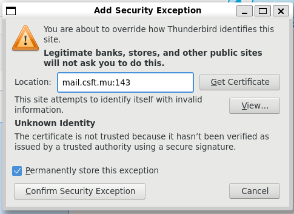
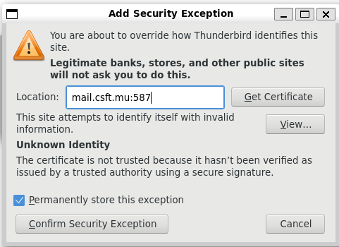
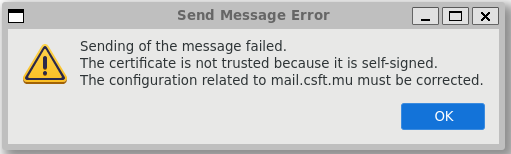

# CLI Mailing

```bash
yum install -y mailx
echo "This is a test email body" | mail -s "Mailx" john@csft.mu
```

# GUI for Mailing

To setup an email account in Thunderbird, you must use the password for a previously created virtual user on the mail server. E.g. email = `john@csft.mu` and password = `john`. Do not use Thunderbird's manual configuration.

When you add an account for the first time, you will see the following exception which you can ignore:



When sending an email for the first time you will see the following errors which can be ignored:





# Mail Backup ✅

Create a file `/usr/local/bin/mail-backup.sh` with the following contents:

```bash
#!/bin/bash

# Set backup destination
BACKUP_DIR="/backup/email"
TIMESTAMP=$(date +'%Y-%m-%d_%H-%M-%S')
BACKUP_FILE="$BACKUP_DIR/email_backup_$TIMESTAMP.tar.gz"

# Create backup directory if it doesn't exist
mkdir -p "$BACKUP_DIR"

# Backup mail directories for system users
tar -czf "$BACKUP_FILE" /home/*/mail --ignore-failed-read 2>/dev/null

# Keep only the last 7 backups
find "$BACKUP_DIR" -type f -name "email_backup_*.tar.gz" -mtime +7 -delete

# Log backup completion with timestamp
echo "$(date +'%Y-%m-%d %H:%M:%S') - Backup completed: $BACKUP_FILE" >> /var/log/email_backup.log
```

Install packages and start crond:

```bash
yum install crontabs cronie cronie-anacron -y
systemctl start crond
systemctl enable crond
```

Edit crontab:

```bash
crontab -e
```

Add this line at the bottom to run the job daily at 2 AM:

```
0 2 * * * /usr/local/bin/backup-emails.sh
```

Assuming the job has run at least once, check if backups are being created:

```bash
ls -lh /backup/email/
```

Assuming the job has run at least once, check logs:

```bash
cat /var/log/email_backup.log
```

To unarchive and extract:

```bash
tar -xvfz archive.tar.gz
```

# Spam Detection ✅

> Reference: https://www.linuxbabe.com/redhat/spamassassin-centos-rhel-block-email-spam

Install packages:

```bash
yum install -y epel-release spamassassin spamass-milter
```

Start services:

```bash
systemctl start spamassassin
systemctl enable spamassassin
systemctl start spamass-milter
systemctl enable spamass-milter
```

Append the following lienes to `/etc/postfix/main.cf`:

```
# Milter configuration
milter_default_action = accept
milter_protocol = 6
smtpd_milters = unix:/run/spamass-milter/spamass-milter.sock
non_smtpd_milters = $smtpd_milters
```

Edit `/etc/sysconfig/spamass-milter` as follows:

```diff
- #EXTRA_FLAGS="-m -r 15"
+ EXTRA_FLAGS="-m -r 8 -g sa-milt"
```

Add postfix user to the sa-milt group, so that Postfix will be able to communicate with spamass-milter:

```bash
gpasswd -a postfix sa-milt
```

Restart services:

```bash
systemctl restart postfix spamass-milter
```

## Move Spam into Junk Folder ❌

```bash
yum install -y dovecot-pigeonhole
```

Edit `/etc/dovecot/conf.d/15-lda.conf` to add the sieve plugin:

```diff
protocol lda {
    # Space separated list of plugins to load (default is global mail_plugins).
-    mail_plugins = $mail_plugins
+    mail_plugins = $mail_plugins sieve
}
```

Edit `/etc/dovecot/conf.d/20-lmtp.conf` to add the sieve plugin:

```diff
protocol lmtp  {
-    mail_plugins = $mail_plugins
+    mail_plugins = $mail_plugins sieve
}
```

Add the following line on line 79 in `/etc/dovecot/conf.d/90-sieve.conf`:

```
sieve_before = /var/mail/SpamToJunk.sieve
```

Create `/var/mail/SpamToJunk.sieve` with the following contents:

```
require "fileinto";

if header :contains "X-Spam-Flag" "YES"
{
   fileinto "Junk";
   stop;
}
```

Compile the script:

```
sievec /var/mail/SpamToJunk.sieve
```

Edit `/etc/dovecot/conf.d/10-mail.conf` so that individual user's script can be stored in his directory:

```
mail_home = /var/vmail/%d/%n
```

Restart dovecot:

```bash
systemctl restart dovecot
```

## Test Spam

Send a test email with the GTUBE (Generic Test for Unsolicited Bulk Email) string to check if SpamAssassin flags it as spam:

```
XJS*C4JDBQADN1.NSBN3*2IDNEN*GTUBE-STANDARD-ANTI-UBE-TEST-EMAIL*C.34X
```

If everything is working correctly, SpamAssassin should block the email.

To manully test SpamAssassin:

```
spamassassin -t < test-email.eml
```

# Virus Detection ✅

> Reference: https://www.transip.eu/knowledgebase/700-installing-clamav-in-centos-almalinux

Install latest version for Extra Packages for Enterprise Linux (EPEL):

```bash
yum install -y epel-release
```

Install ClamAV:

```bash
yum -y install clamav-server clamav-data clamav-update clamav-filesystem clamav clamav-scanner-systemd clamav-devel clamav-lib clamav-server-systemd
```

In `/etc/clamd.d/scan.conf`, **delete** the following line:

```
#Example
```

In `/etc/clamd.d/scan.conf`, **uncomment** the following line:

```
LocalSocket /run/clamd.scan/clamd.sock
```

In `/etc/freshclam.conf` delete the following line:

```
#Example
```

Download the latest virus definitions:

```bash
freshclam
```

We need to create a systemd service so clamAV is automatically started and executed. Create a new file `/usr/lib/systemd/system/freshclam.service` with the following contents:

```
[Unit]
Description = freshclam scanner
After = network.target
[Service]
Type = forking
ExecStart = /usr/bin/freshclam -d -c 1
Restart = on-failure
PrivateTmp =true
[Install]
WantedBy=multi-user.target  
```

Start services:

```bash
systemctl start clamd@scan
systemctl enable clamd@scan
systemctl start freshclam
systemctl enable freshclam
```

To perform a manual scan of a specific directory:

```bash
clamscan -r /path/to/directory
```

## Automatic scan using CRON

You can schedule automatic scans using cron.

Install packages and start crond:

```bash
yum install crontabs cronie cronie-anacron -y
systemctl start crond
systemctl enable crond
```


Open the cron editor:

```
sudo crontab -e
```

Add a daily scan job:

```
0 2 * * * /usr/bin/clamscan -r /home --log=/var/log/clamscan.log
```

This runs a scan every night at 2 AM and logs results.


# Auto-reply

```bash
yum install dovecot-pigeonhole -y
```
