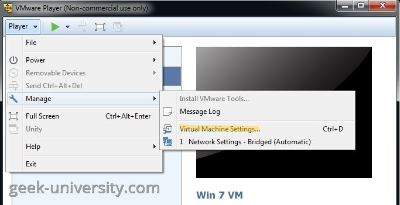
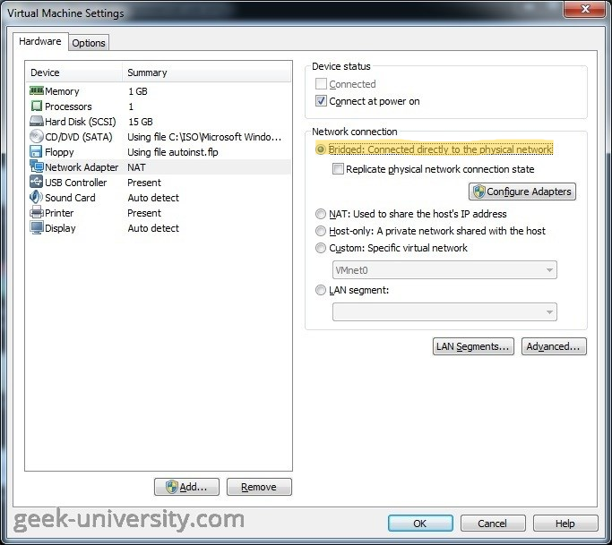

# Samba Lab

## Prerequisites

Your Windows machine must be able to communicate with your VM. To check if this is possible:

1. On VM, connect to the internet and note down the server's IP address using `ifconfig ens33 | awk '/inet / {print $2}'`.
2. In Windows Command Prompt, run `ping <SERVER_IP>` where `<SERVER_IP>` with the IP obtained in the previous step.
3. You should see a similar output with no packet timeout:
   ```
   Pinging 172.23.49.69 with 32 bytes of data:
   Reply from 172.23.49.69: bytes=32 time<1ms TTL=64
   Reply from 172.23.49.69: bytes=32 time<1ms TTL=64
   Reply from 172.23.49.69: bytes=32 time<1ms TTL=64
   Reply from 172.23.49.69: bytes=32 time<1ms TTL=64

   Ping statistics for 172.23.49.69:
      Packets: Sent = 4, Received = 4, Lost = 0 (0% loss),
   Approximate round trip times in milli-seconds:
      Minimum = 0ms, Maximum = 0ms, Average = 0ms
   ```

If you obtained packet timeouts, then you need to use the Bridge networking mode on your VM:





Finally, repeat the above steps to verify that your VM is accessible from Windows.

## Basic Setup

1. On your VM, login as root and connect to the internet.
2. Note down the server's IP address using `ifconfig ens33 | awk '/inet / {print $2}'`.
3. On Windows:
   1. Open Command Prompt **as administrator**.
   2. Open your host files with notepad: `notepad "C:\Windows\System32\drivers\etc\hosts"`
   3. Identify all **uncommented entries** containing `centos` as alias. If found, **delete the entry or comment it**.
   4. Add a new entry to the file:
      ```
      <SERVER_IP> server1.example.com centos
      ```
      Replace `<SERVER_IP>` with the IP obtained in step 2.
   5. Save the file with `CTRL + S` then close notepad.
4. On VM, run:
   ```bash
   curl -s https://raw.githubusercontent.com/creme332/centos-scripts/refs/heads/main/samba-lab/server.sh | sh
   ```
5. On Windows, verify that the correct folders were created. Press `WIN + R` then enter `\\centos`. You should see two folders: Anonymous, Secure.

> [!NOTE]
The login details for `Secure` are username `rasho` and password `linux5000`. If you had previously created `rasho`, your login details are unchanged.

> [!NOTE]
Each time you restart your VM, you need to run `systemctl restart smb.service nmb.service`.

> [!WARNING]
When logging into `Secure` folder, do **not** tick `Save Credentials`.

### Verification

- [ ] In Windows, you should be able to create a file in `Anonymous` without login. 
- [ ] The newly created file should appear in `/samba/anonymous`.
- [ ] You should be prompted for login details when attempting to access `Secure`. 
- [ ] In Windows, you should be able to create a file in `Secure` after login. 
- [ ] The newly created file should appear in `/home/secure`.
- [ ] Everything still works after you restart your VM. You need to restart the Samba server on the VM on startup.

> [!NOTE]
Windows remembers the credentials you used for a Samba share until you log off or reboot. To test authentication again without restarting, you need to clear the cached network session. You can do that with the net use command in Windows command prompt: `net use * /delete`. You then need to wait a few seconds before using `WIN + R` again.