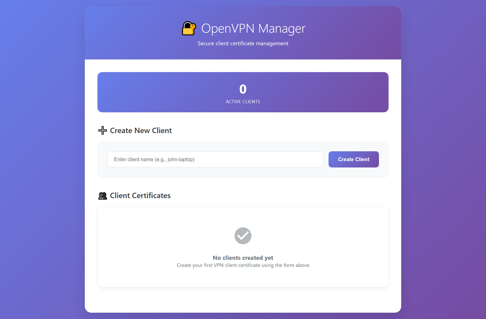

# VPN Lab

- [VPN Lab](#vpn-lab)
  - [Prerequisites](#prerequisites)
  - [Installation](#installation)
    - [Server VM](#server-vm)
    - [Client VM](#client-vm)
  - [Usage](#usage)
  - [Verification](#verification)
  - [Commands for Manual Testing](#commands-for-manual-testing)
  - [Uninstallation](#uninstallation)
  - [Extra: VPN Client Management via GUI](#extra-vpn-client-management-via-gui)
    - [Installation](#installation-1)
    - [Usage](#usage-1)


## Prerequisites

- 2 VMs: 1 server, 1 client
- Resolve EOL issues on both VMs if needed
- Both VMs must have root privileges and internet connectivity
- NAT mode enabled on both VMs (other network modes may work but are untested)
- Client must be able to ping the server
- **No existing OpenVPN or EasyRSA installations (these will conflict with the setup). If previously installed, run the uninstallation scripts first**

## Installation

### Server VM

1. Run setup script:  
   ```bash
   curl -s https://raw.githubusercontent.com/creme332/centos-scripts/refs/heads/main/vpn-lab/server.sh | bash -s client
   ```
   This will create a file `client.ovpn` for a VPN client named `client`.
2. Determine the server's IP address using `ifconfig ens33`.

### Client VM

1. Run setup script:
   ```bash
   curl -s https://raw.githubusercontent.com/creme332/centos-scripts/refs/heads/main/vpn-lab/client.sh | sh
   ```
2. To transfer the newly created ovpn file from server to client:
   ```bash
   scp root@<SERVER_IP>:/etc/openvpn/clients/client.ovpn ~/client.ovpn
   ```
   where you need to replace `<SERVER_IP>` with the IP address of the server. You will prompted for the **server**'s root password.

## Usage

1. On both client and server VMs, ensure you have root access and internet connectivity.
2. On server VM, run `systemctl status openvpn-server@server` to check if VPN service is running.
3. On client VM, connect to the VPN:
   ```bash
   openvpn --config ~/client.ovpn
   ```
   Note: This command runs in the foreground and **will continue running while connected to the VPN**.
4. On client VM, open **another** terminal and run:
   ```bash
   vpn-verify
   ```
   Look for these signs that the VPN is working:

   - `✓ VPN interface (tun0) is UP` with VPN IP `10.8.0.x`
   - `✓ Traffic to 8.8.8.8 will use VPN interface`
   - `✓ SUCCESS: First hop is VPN gateway (10.8.0.x subnet)`
   - `✓ Can reach 8.8.8.8` and `✓ Can reach 1.1.1.1`
   - Final status: `VPN Status: WORKING CORRECTLY`

> [!NOTE]
> The server should start OpenVPN service **automatically** on reboot. If you need to manually restart it, use `systemctl restart openvpn-server@server`.

## Verification

| Test Case ID | Description                                                               | Expected Result                                           |
| ------------ | ------------------------------------------------------------------------- | --------------------------------------------------------- |
| TC-01        | Check if the OpenVPN service is running on the server                     | Service status shows **active (running)**                 |
| TC-02        | Client initiates connection to the OpenVPN server                         | Client connects successfully, no errors in logs           |
| TC-03        | Verify VPN tunnel interface (`tun0`) is created on both client and server | `ip addr show tun0` shows interface with assigned VPN IPs |
| TC-04        | On client, trace route to external IP (`traceroute 8.8.8.8`)              | First hop should be VPN server's internal IP (10.8.0.1)   |
| TC-05        | Ping OpenVPN server's VPN IP from client                                  | `ping 10.8.0.1` successful from client                    |
| TC-06        | Ping OpenVPN client's VPN IP from server                                  | `ping 10.8.0.6` successful from server (IP may vary)      |
| TC-07        | Verify encrypted traffic on server WAN interface                          | `tcpdump -i ens33 udp port 1194` shows encrypted packets  |
| TC-08        | Reboot server, then connect from client                                   | Client reconnects successfully after server reboot        |

## Commands for Manual Testing

```bash
# Check server status
systemctl status openvpn-server@server

# Check VPN interfaces
ip addr show tun0

# Test VPN routing
traceroute 8.8.8.8

# Monitor VPN traffic (on server)
tcpdump -i ens33 udp port 1194
```

## Uninstallation

To completely remove OpenVPN and EasyRSA:

```bash
# Reset server
curl -s https://raw.githubusercontent.com/creme332/centos-scripts/refs/heads/main/vpn-lab/reset-server.sh | bash


# Reset client
curl -s https://raw.githubusercontent.com/creme332/centos-scripts/refs/heads/main/vpn-lab/reset-client.sh | bash
```

## Extra: VPN Client Management via GUI



### Installation

Run the following commands on VPN server:

```bash
# Install python
curl -s https://raw.githubusercontent.com/creme332/centos-scripts/refs/heads/main/helper/yum.sh | sh
yum install rh-python38 -y

# Install scripts
cd ~
wget https://raw.githubusercontent.com/creme332/centos-scripts/refs/heads/main/vpn-lab/server.sh
wget https://raw.githubusercontent.com/creme332/centos-scripts/refs/heads/main/vpn-lab/ui/server.py
```

### Usage

On server VM:

1. Enable Python 3.8: `scl enable rh-python38 bash`.
2. Launch UI server: `python ~/server.py`.
3. Open `localhost:8080` in your browser.